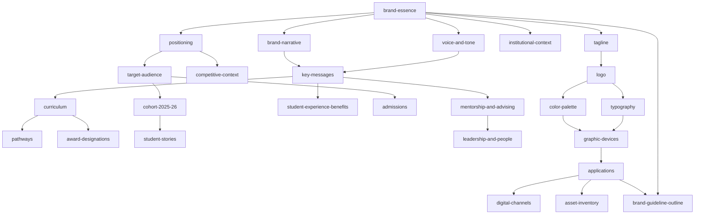

# BDSIS Brand Knowledge Graph

A map of everything we know about the **Bachelor's Degree Scheme in Interdisciplinary Studies (BDSIS)** — PolyU's new elite programme — distilled from the source materials in this folder, as the foundation for a **brand guideline**.

> **Sources analysed:** "BDSIS presentation slides for PolyU colleagues.pptx" (56 slides), 8pp brochure (Ver 6 Final, 2026-05-06), BDSIS Logo Pack, Online Banners & Graphics.

## How to read this graph

Notes are linked with `[[wikilinks]]` (open this folder as an Obsidian vault to see the graph view). Each note carries frontmatter (`type`, `status`, `sources`). `status: inferred` flags facts derived from observation (e.g. sampled colors) rather than stated in source documents.

## Strategy — what the brand stands for

- [[brand-essence]] — mission, vision, the core idea
- [[brand-narrative]] — the "why" story: AI, interdisciplinarity, human-centric society
- [[positioning]] — elite tier; "an upgrade of any PolyU programme"
- [[brand-themes]] — dual themes: prestige × stewardship ("elite is the duty, not the reward")
- [[target-audience]] — cream-of-the-crop students, HK + global
- [[key-messages]] — the four pillars and proof points
- [[tagline]] — "Breaking Barriers, Empowering Future Leaders."
- [[voice-and-tone]] — how the brand speaks
- [[competitive-context]] — relation to other PolyU programmes

## Programme — the product behind the brand

- [[programme-facts]] — JS3000, duration, credits, contacts
- [[curriculum]] — Interdisciplinary Core + Flexible Major + Common UG Core
- [[pathways]] — the three self-determined curriculum pathways
- [[mentorship-and-advising]] — Personal Academic Mentors, four-tier advising
- [[student-experience-benefits]] — hall residence, waived fees, overseas exposure
- [[admissions]] — entrance requirements (HKDSE / IB / GCE / JEE)
- [[award-designations]] — BA/BBA/BEng/BSc rules
- [[leadership-and-people]] — Prof. Daniel Shek, Prof. Alan Lau, mentors
- [[student-stories]] — Lyra, Samuel, Yiran + cohort study plans
- [[cohort-2025-26]] — founding cohort profile
- [[institutional-context]] — PolyU, College of Undergraduate Studies

## Visual identity — how the brand looks

- [[logo]] — the "iS" monogram and lockup system
- [[color-palette]] — gradient spectrum (sampled hex values)
- [[typography]] — thin geometric sans system
- [[graphic-devices]] — quadrant grid, triangle mosaic, letter-replacement
- [[imagery-style]] — photography and illustration treatment
- [[applications]] — brochure, banners, social graphics
- [[digital-channels]] — social handles and QR system
- [[asset-inventory]] — file-level inventory of supplied assets

## Deliverable

- [[brand-guideline-outline]] — proposed structure of the brand guideline + open gaps

## Graph overview

